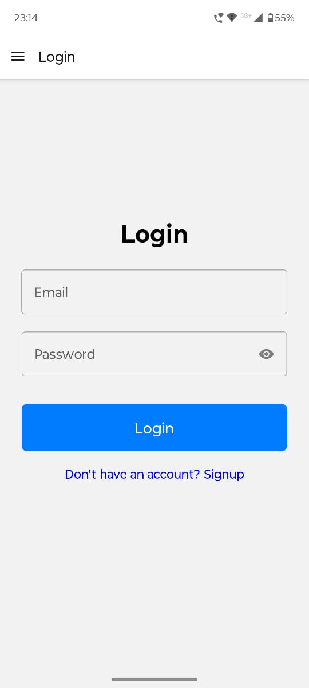
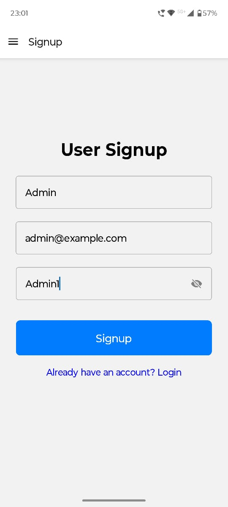
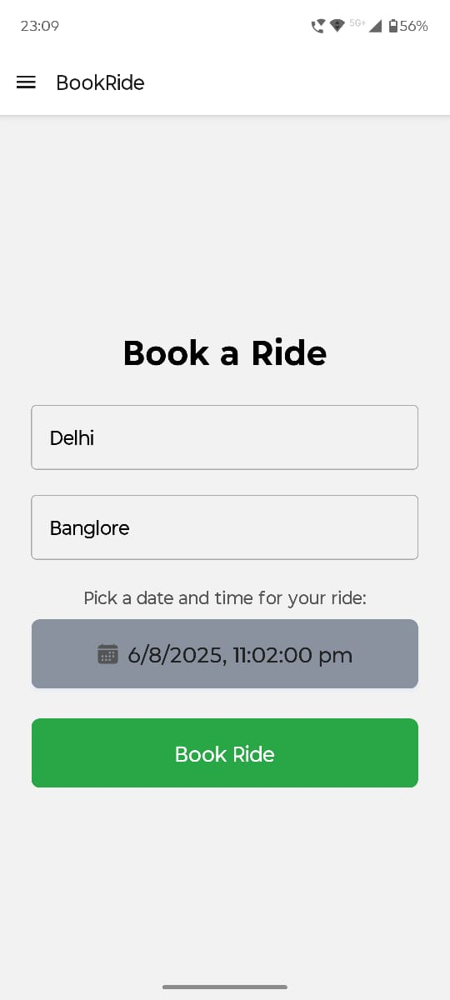
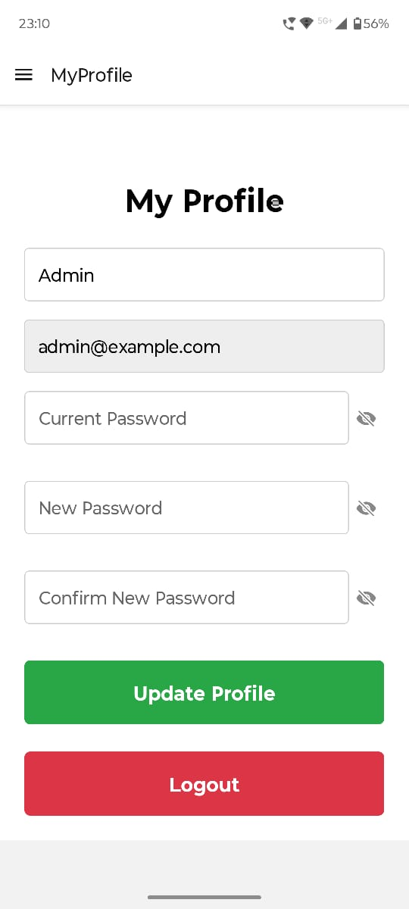
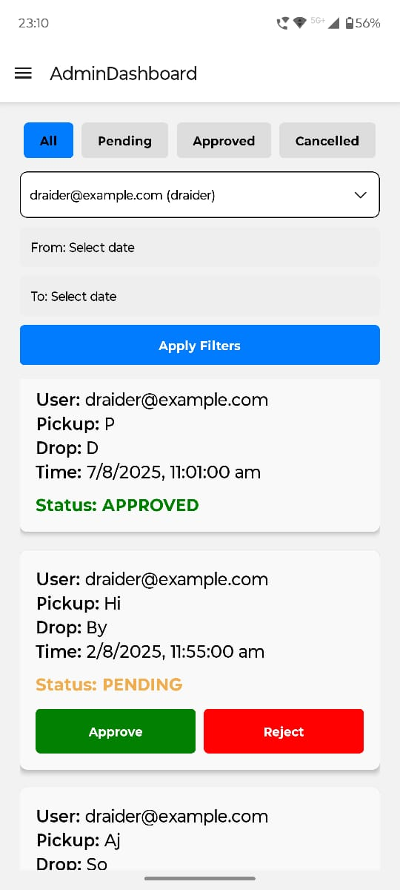
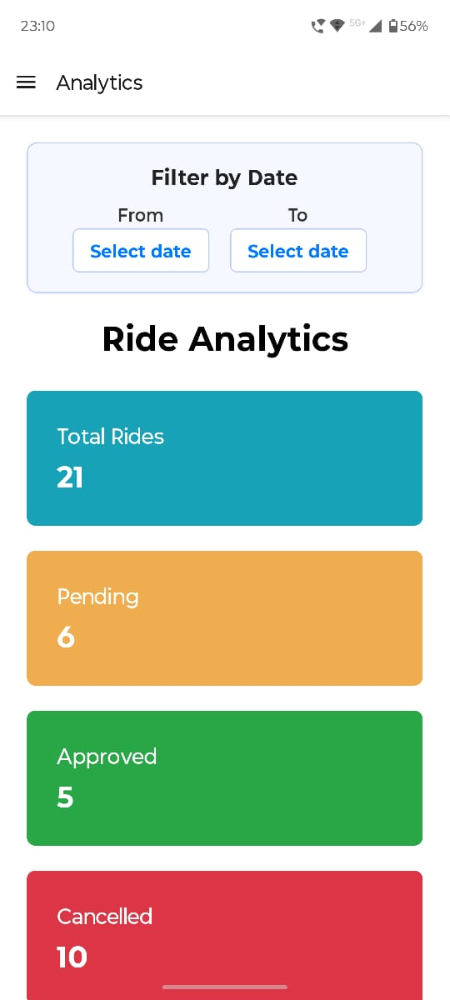

# 🚗 Corporate Ride Scheduling System

An end-to-end platform for booking, managing, and analyzing corporate rides. This project includes both a **React Native + Expo frontend** and a **Node.js + Express backend**. It is designed for seamless ride scheduling, user management, and admin analytics, with a modern UI and mobile-first experience.

---

## 🌟 Project Overview

Corporate Ride Scheduling System enables:

- Employees to register, login, book rides, view and cancel their rides
- Admins to approve/reject rides, view analytics, and manage users
- Real-time feedback and notifications
- Role-based access and navigation

---

## 🎥 Video Tutorial

Watch a full walkthrough of the app here:

- [Video Tutorial (Google Drive)](https://drive.google.com/file/d/1QSELqBB-vXnNYlpAKc0y0eKmpeyCmMFk/view?usp=sharing)

---

## 📱 Screenshots

<p align="center">
  
  
  
  
  
  
  
  
  
</p>

---

## ✨ Key Features

- **User & Admin Roles:** Separate flows and navigation for employees and admins
- **Book Rides:** Select pickup/dropoff, date & time, and view ride status
- **Admin Dashboard:** Approve/reject rides, filter by status/user/date, view analytics
- **Profile Management:** Update name, change password, logout
- **Analytics:** Visual breakdown of rides by status and date
- **Responsive UI:** Works on mobile and web
- **Notifications:** Toasts for actions and errors

---

## ⚠️ Important Information

- **Admin accounts can currently only be created directly in the database. There is no UI for admin registration.**
- For demo and testing, an admin account is already available:
  - **Email:** `admin@example.com`
  - **Password:** `Admin1`
- Use these credentials to access admin-specific features in the app.

---

## 🌍 Deployment

- **Frontend:** Expo (see `frontend/README.md` for details)
- **Backend:** Node.js/Express (see `backend/README.md` for details)
- **Live Backend:** [https://corporate-ride-scheduling-system-backend.onrender.com](https://corporate-ride-scheduling-system-backend.onrender.com)

- **App Link:** [Download the App here](https://drive.google.com/file/d/1TnxqHoYbBaDAYxZvwf6Fo6K2JpTfg5ym/view?usp=sharing)

> **Note:**
>
> - After downloading, the app may take some time to install depending on your device and internet speed.
> - Make sure to enable installation from unknown sources in your device settings to allow the app to install successfully.

---

## 🚀 Try the App on Expo Go

Scan the QR code below using the **Expo Go** app:


> You do **not** need to install the app directly on your phone. Just scan the QR code in Expo Go and you can instantly access and use the app.
> Make sure you have the [Expo Go app](https://expo.dev/client) installed on your phone.

---

## 🗂️ Project Structure

```
Corporate-Ride-Scheduling-System/
  backend/    # Node.js + Express API
  frontend/   # React Native + Expo app
```

---

## 📄 Documentation

- [Frontend Guide](frontend/README.md)
- [Backend Guide](backend/README.md)

---

## 🤝 Contribution

Contributions are welcome! Feel free to fork, open a pull request, or raise an issue.

---

## 👨‍💻 Author

Made with ❤️ by [Ashutosh Tripathi](https://github.com/1ashutosh1)
